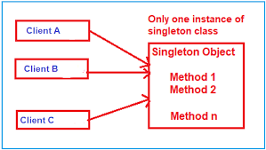
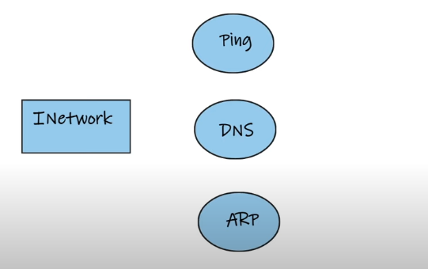
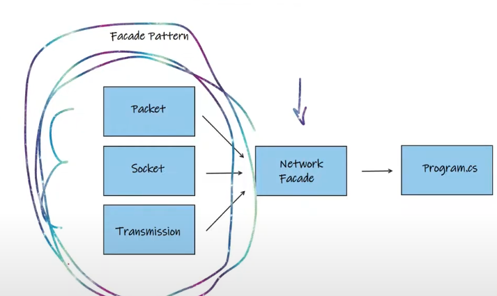
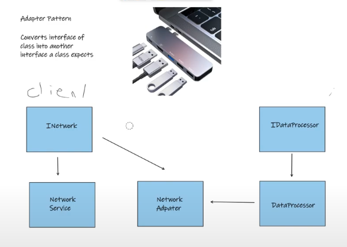
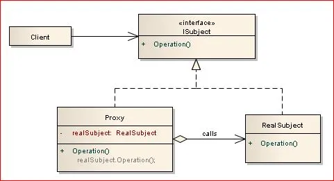
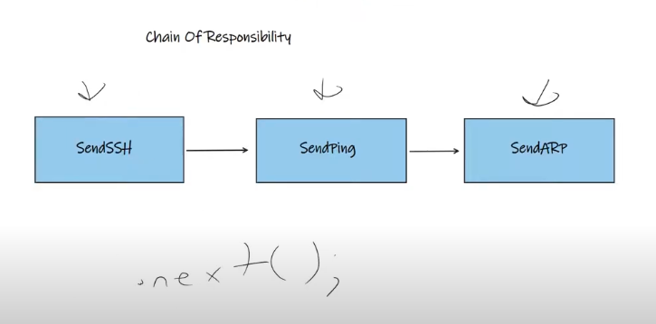

# Design Patterns in C#

In this section, Design patterns in c# will be included.

## Topics

### Singleton Pattern

### Factory Pattern

### Factory Pattern

### Adapter Pattern

### Proxy Pattern

### Chain of Responsibility Pattern

## Resources

-   https://www.youtube.com/watch?v=DTBm3uqLuUE&list=PL82C6-O4XrHeS_EJlqBSvvvAfZr9mus-V&pp=iAQB
-   https://www.c-sharpcorner.com/UploadFile/8911c4/singleton-design-pattern-in-C-Sharp/
-   https://www.c-sharpcorner.com/article/factory-design-pattern-in-c-sharp/
-   https://www.c-sharpcorner.com/article/facade-design-pattern-using-c-sharp/
-   https://www.c-sharpcorner.com/UploadFile/efa3cf/adapter-design-pattern-in-C-Sharp/
-   https://www.c-sharpcorner.com/UploadFile/b1df45/proxy-design-pattern-using-C-Sharp/
-   https://mohamed-hendawy.medium.com/chain-of-responsibility-design-pattern-in-c-with-examples-d87da6e5ead
