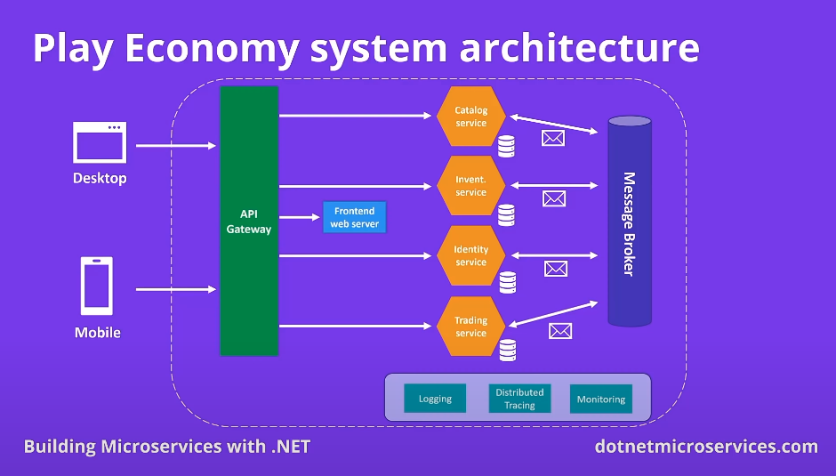
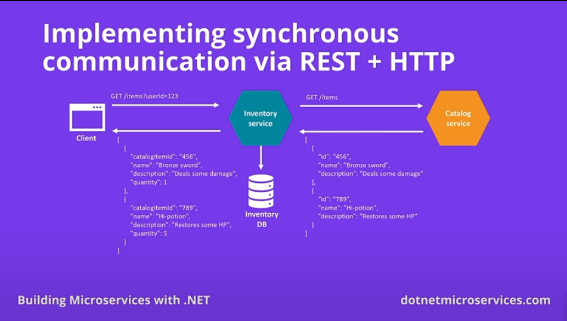
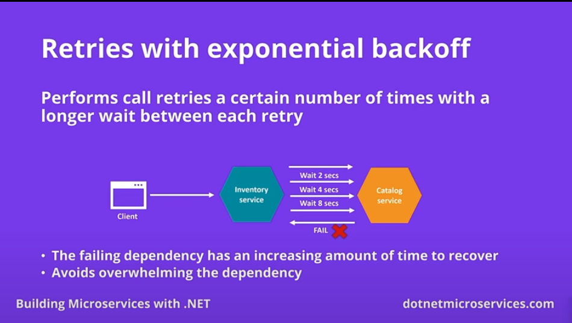
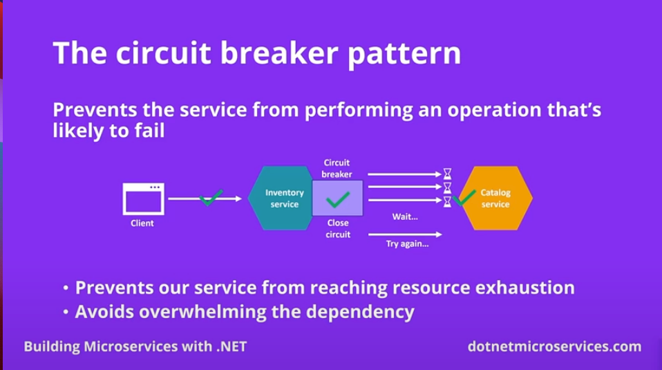
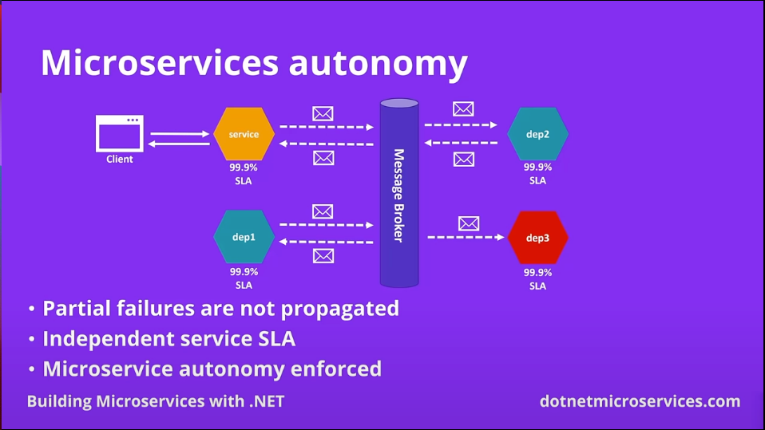
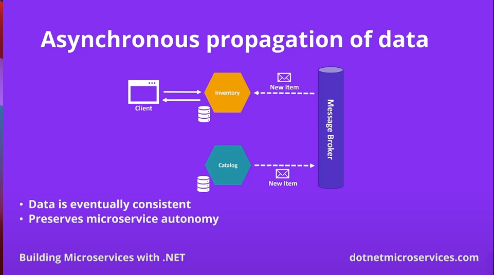
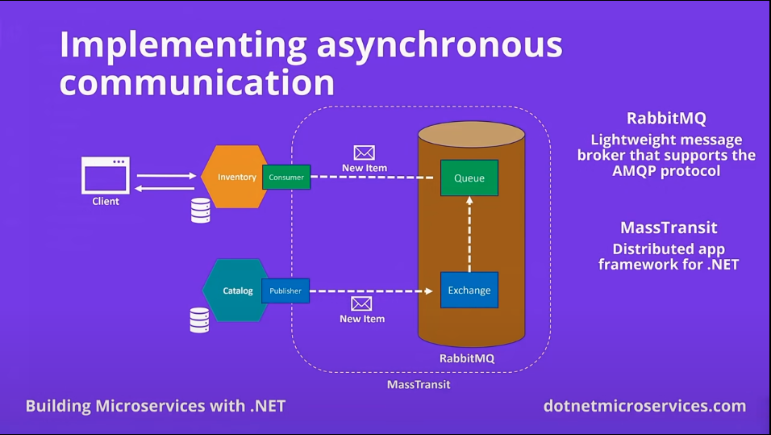

# .NET Microservices Project One

This Project is from the [.NET Microservices](https://www.youtube.com/watch?v=CqCDOosvZIk&t=673s). and The system is `Play Economy` Game system.

## Tech Stacks

- MongoDB
- Docker
- RabbitMQ

## Docker Containers

- MongoDB Container
- RabbitMQ Container
- Seq Container
- Prometheus Container
- Grafana Container

## High Level Architecture



### Create Microservices

```bash
mkdir Play.Catalog

mkdir src

cd src
```

```bash
dotnet new webapi -n Play.Catalog.Service
```

### Create Common Lib

```bash
mkdir Play.Common

mkdir src

cd src
```

```bash
dotnet new classlib -n Play.Common
```

**Publish in Local**

```bash
cd Play.Common/src/Play.Common

dotnet pack -o ../../../packages/
```

### Docker setup

```bash
docker run -d --rm --name mongo -p 27017:27017 -v mongodbdata:/data/db mongo
```

## Microservice Communication Styles (Notes)

**Synchronous**

The client send a request and wait for a response from the service.

**Asynchronous**

The client send a request to the service but the response, if any, is not sent immediately.

### Service Communication



### Retries with exponential backoff



### Circuit Breaker Pattern



### Microservice Autonomy



### Async Propagation of Data



### Implementing asynchronous communication


