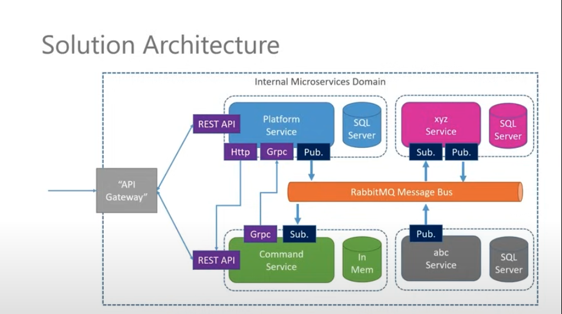
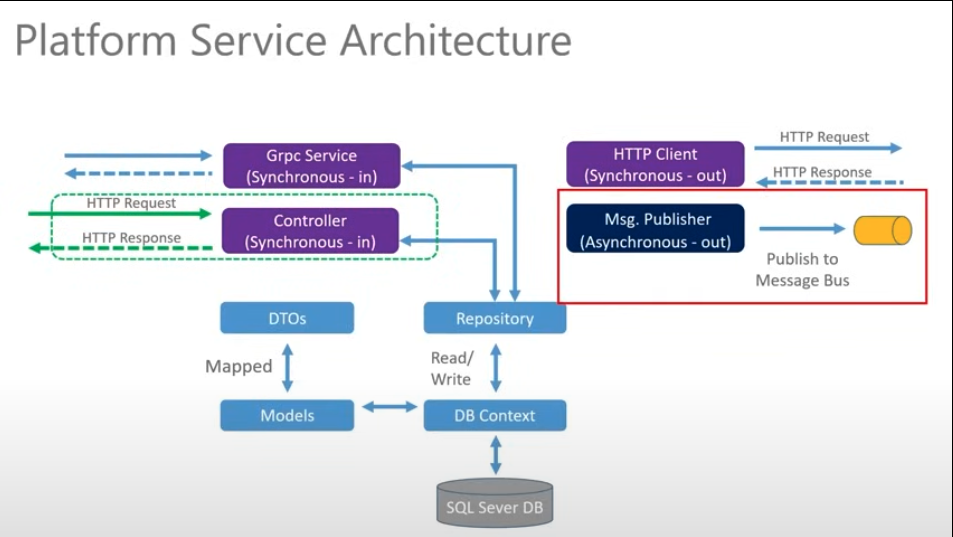
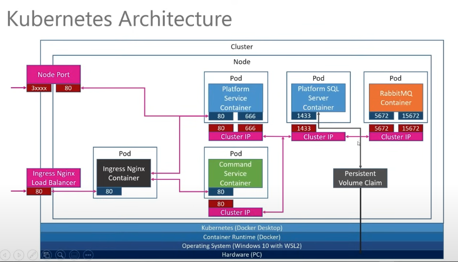
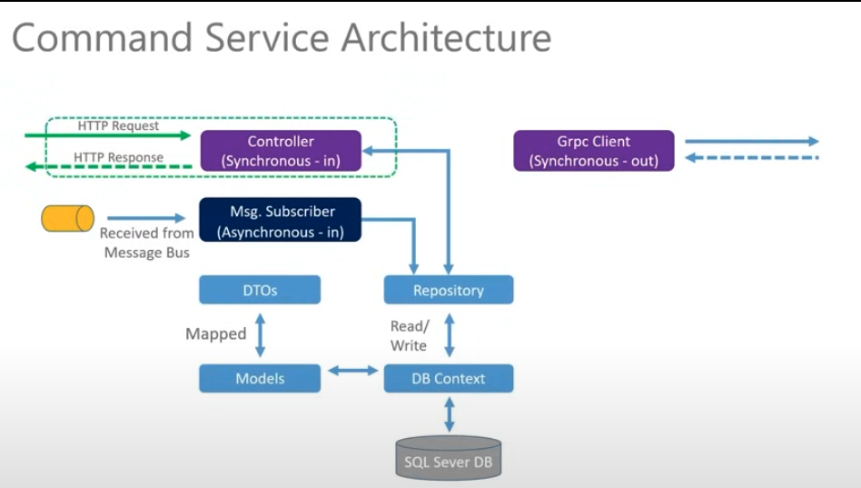

# .NET Microservices Project Three

This Project is from the [.NET Microservices](https://www.youtube.com/watch?v=DgVjEo3OGBI).
It will include two services `Platform service` and `Command service`.

> This Microservice projects is mostly focused on the `docker`, `k8s`.

## Tech Stacks

-   Postgres
-   Docker
-   Kubernetes
-   gRPC (Synchronous messaging)
-   RabbitMQ (Asynchronous messaging)

## Solution Architecture



## Platform service Architecture



## Kubernetes Architecture



## Command service Architecture



## Docker Commands

### Docker Build

```bash
docker build -t thutasann/platformservice .
```

### Docker Push

```bash
docker push thutasann/platformservice
```

> http://localhost:5000/swagger/index.html <br/>

## Kubernetes Commands

### Check version

```bash
kubectl version
```

### Create Deploy

```bash
cd K8S

kubectl apply -f platforms-depl.yaml
```

### Get Deployments

```bash
kubectl get deployments
```

### Delete Deployment / Service

```bash
kubectl delete deployment platforms-depl
```

### Get pods

```bash
kubectl get pods
```
