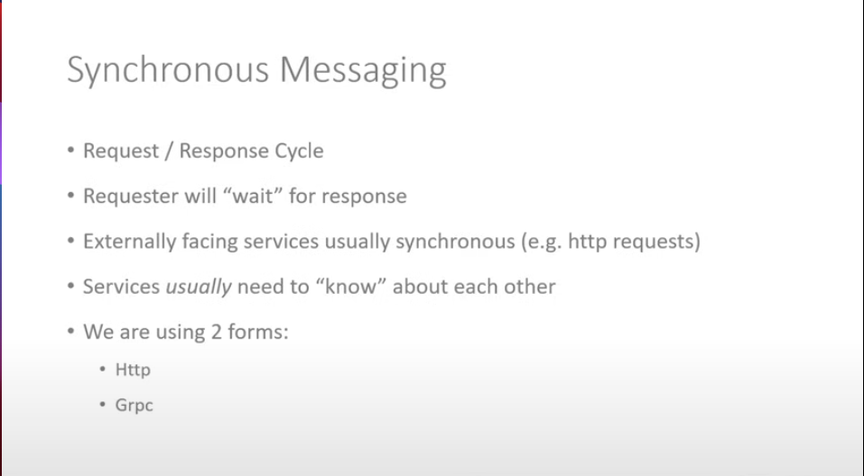
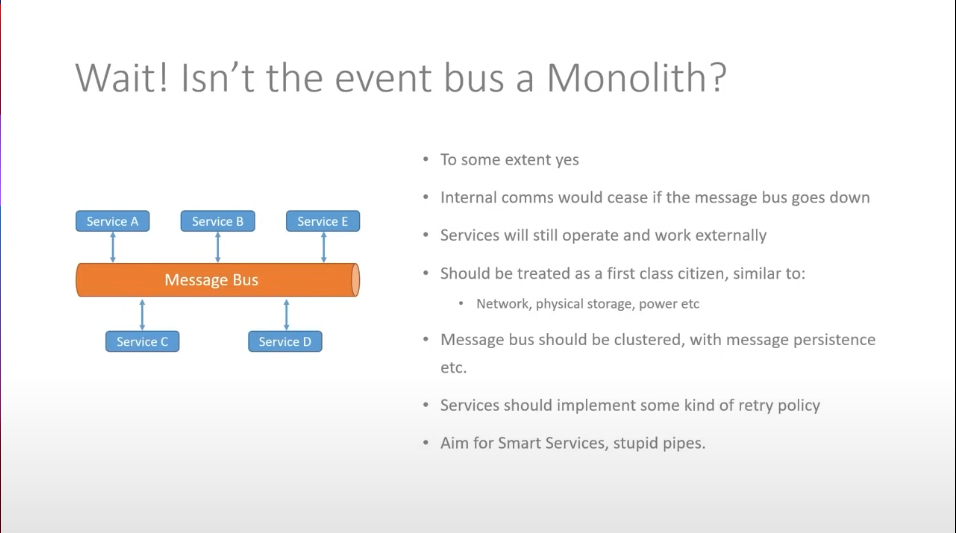
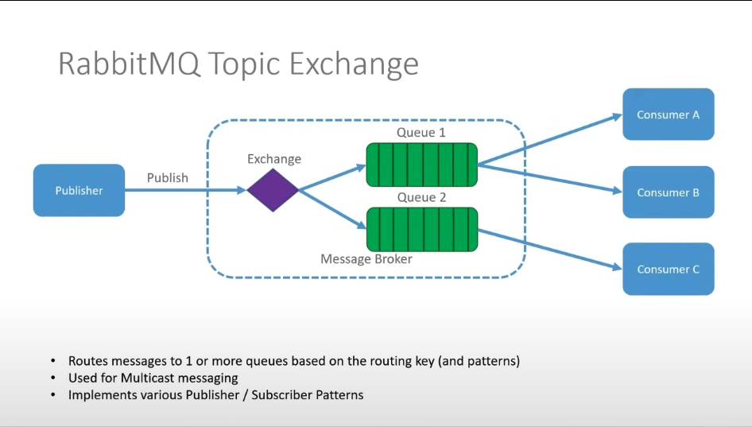
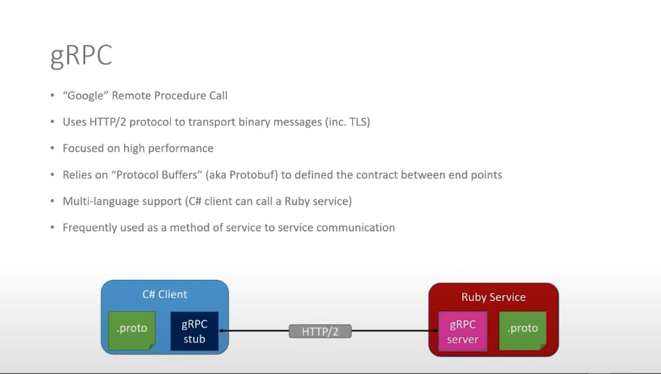

# .NET Microservices Project Three

This Project is from the [.NET Microservices](https://www.youtube.com/watch?v=DgVjEo3OGBI).
It will include two services `Platform service` and `Command service`.

> This Microservice projects is mostly focused on the `docker`, `k8s`.  

> For now, InMemo DB is used for both services.

## Tech Stacks

-   MySql
-   Docker
-   Kubernetes
-   gRPC
-   RabbitMQ

## Solution Architecture

## Platform service Architecture

## Kubernetes Architecture

## Command service Architecture

## Synchronous Messaging

## Asynchronous Messaging

## Message Bus

## RabbitMQ Topic Exchange

## gRPC

## Commands

-   [Commands Here](./Commands.md)

### Deployed NodePort Services

**Platforms Service (replace with your NodePort)**

> http://localhost:32208/swagger/index.html  

**Platforms Service (replace with your NodePort)**

> http://localhost:32136/swagger/index.html  

**RabbitMQ**

> http://localhost:15672/
