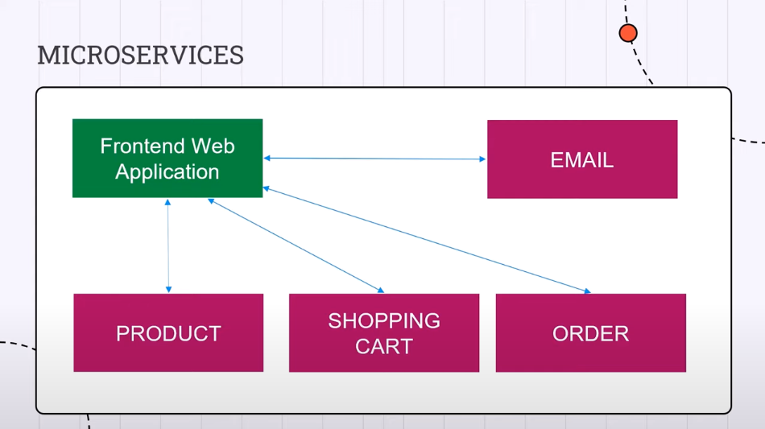
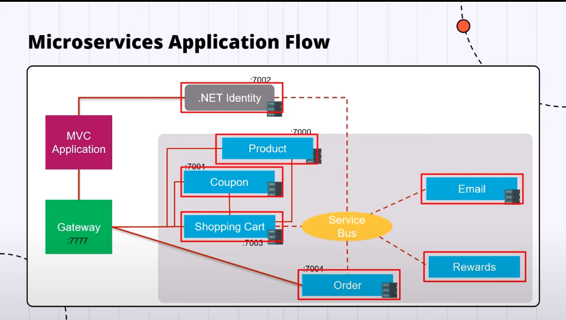

# .NET Microservices Project Two

This Project is from the [Introduction to .NET Microservices ](https://www.youtube.com/watch?v=Nw4AZs1kLAs). and The system is Ecommerce System.

## TechStacks

- EF Core
- MySql
- Azure Message Bus

## Overview / Microservice Application Flow




## Scripts

### Create new Solution

```bash
dotnet new sln -n Mango
```

### Createing API Service

```bash
cd Services

dotnet new webapi -o <project-name>
```

### EF Database Migration

```bash
dotnet tool install --global dotnet-ef --version 7.*
```

```bash
dotnet ef migrations add init
```

```bash
dotnet ef database update
```
